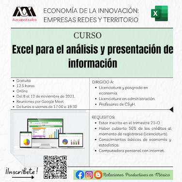

<body>
  

  
### Curso de actualización de Excel

En el Área de Relaciones Productivas en México fomentamos que nuestro alumnos tengan una formación  integral, por lo que organizamos cursos de actualización para el desarrollo de habilidades tanto para el campo académico como profesional.

Desde el trimestre 2020-Primavera hemos llevado a cabo un curso de Excel, impartido por [Cintia Nava](https://mx.linkedin.com/in/cintia-nava) Enlace de Integración Estadística en el INEGI.

Entre el 8 y el 12 de noviembre de 2021 llevamos a cabo la cuarta promoción de este curso con el nombre Excel para el análisis y presentación de información.

##### Materiales curso
- [Libro Excel ejercicios primera parte.](https://docs.google.com/spreadsheets/d/1zu9z7K1jigyutRla6q5AfQZcr76wJDRz/edit?usp=sharing&ouid=105370908727236507879&rtpof=true&sd=true)
- [Libro de Excel ejercicios segunda parte.](https://docs.google.com/spreadsheets/d/1TGL8j64fXgQwdpTeaiMLzF57mebA4ixa/edit?usp=sharing&ouid=105370908727236507879&rtpof=true&sd=true)

  

</body>